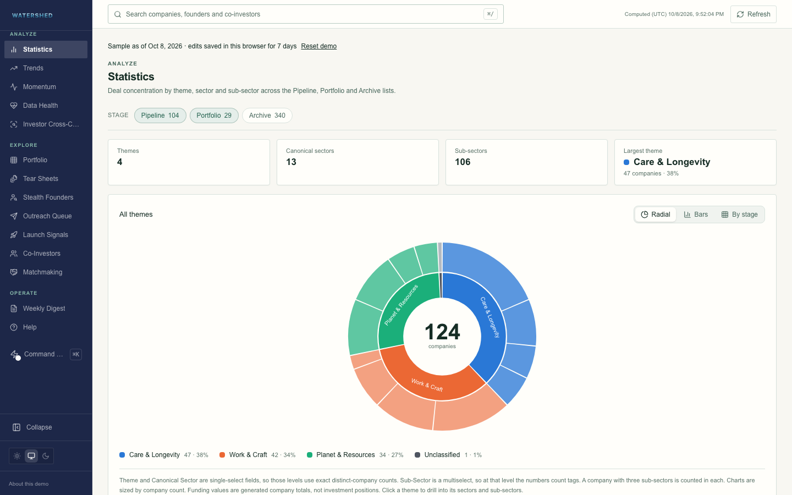

# VC Operations Dashboard Demo

Explore pipeline concentration, founder follow-up, co-investor matching and incomplete
records in a fictional venture workspace.

**[Open the demo](https://vc-ops-dashboard-demo.vercel.app)** · [What the demo represents](content/help/what-this-demo-is.md)



The sample includes company and portfolio views, founder outreach, launch suggestions,
co-investor relationships, score breakdowns, tear sheets, activity diffs and data health.
Global search and the command palette connect these workflows. No account is required.

## Try a workflow

1. Open Statistics and change the list filters. Theme and sector counts use unique
   companies; sub-sector and round memberships can overlap.
2. Open Momentum. Its stage coverage comes from the same records as the funnel chart.
3. Inspect a company or founder. Confirm a sample edit through the command palette.
4. Refresh to see the edit, then use **Reset demo** to restore the original sample.

Company names, people, contact domains and financial values are generated. Fictional
`.example` contacts have disabled links. This public build connects to no real CRM,
email service or enrichment provider. See [NOTICE](NOTICE).

## Run locally

Requires Node.js 22.13 or newer and npm.

```bash
npm ci
npm run dev
```

Open [localhost:3000](http://localhost:3000). No credentials or environment variables
are required. For a production build, run `npm run build` then `npm start`.

## State and history

The dataset reference date is October 8, 2026; computation timestamps are displayed in
UTC. Each request gets its own read cache. Sample edits are held in a bounded,
HTTP-only browser cookie for seven days and follow that browser across refreshes and
server instances. Another visitor receives the untouched seed. Reset clears this demo's
cookie. Limits prevent unlimited notes, records or history; an error asks for reset when
an edit would exceed them. Concurrent UI writes are serialized where browser locks are
available; separate browsers have independent state.

Ten history snapshots, nine with metrics, are illustrative. Deterministic scale factors
and prefixes of the fixed sample create them; they are not measured weekly observations.
Manual diffs compare current visitor edits with the seed. No scheduled collection is
configured. The retired cron endpoint responds with HTTP 410.

Match scores are deterministic heuristics with visible component weights, missing-data
flags and sector-mapping limitations. They are not investment predictions. Funding
raised from all investors is kept separate from undisclosed investment amounts.

## Validate

```bash
npm run format:check
npm run typecheck
npm run lint
npm test
npm run check:docs
npm run build
npx playwright install chromium
npm run test:e2e
```

CI checks the production build and browser flows. Tests cover independent metric
fixtures, hydration across locales/timezones/themes, operating views at four widths,
accessibility, persisted edits, duplicate detection, reset and visitor isolation.
`npm run coverage` measures **field completeness**, not test coverage. The result is
recorded in [COVERAGE.md](COVERAGE.md).

The main paths are `app/` for pages and API routes, `components/` for UI, `lib/` for typed
adapters and domain calculations, `data/seed/` for generated fixtures, and `content/help/`
for workflow explanations. SVG charts and logos are local assets.

MIT. See [LICENSE](LICENSE).
